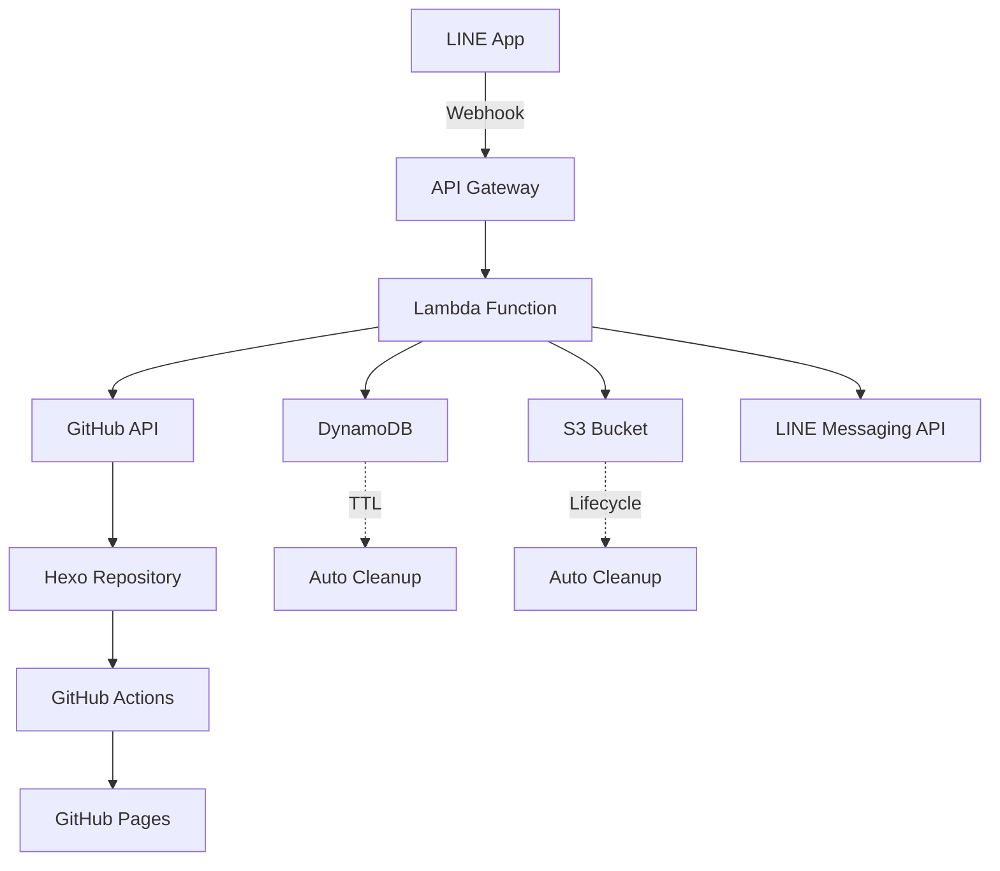
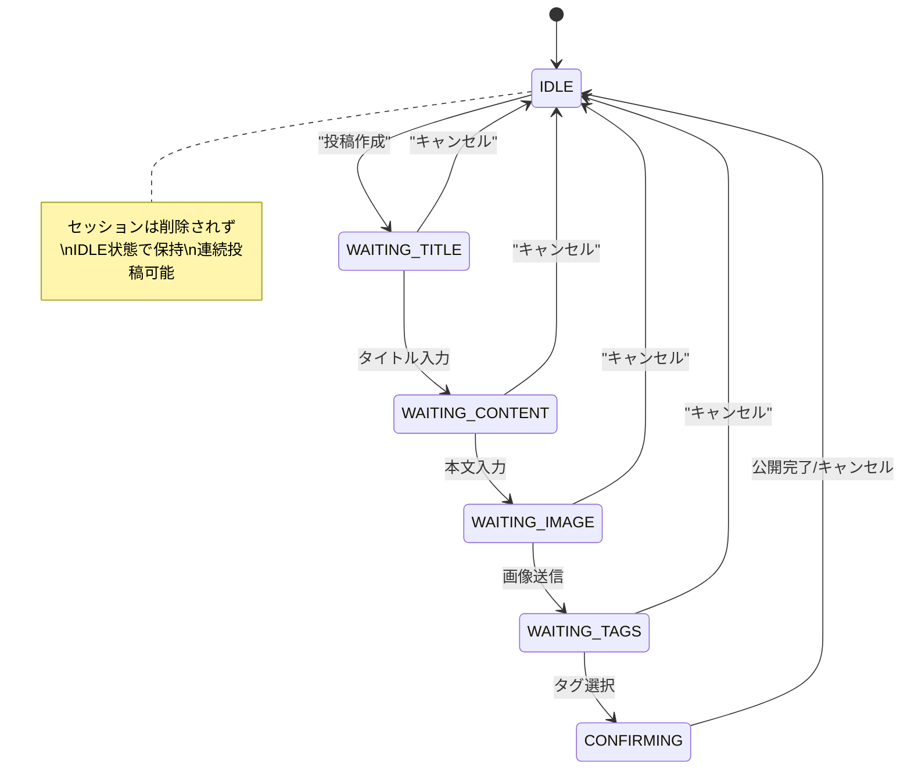

# Design Document: LINE Bot Blog Publisher

## Overview

LINE Bot経由でHexoブログを自動更新するサーバーレスシステム。ユーザーがLINEアプリから画像とテキストを送信し、対話型フローを通じてブログ投稿を作成する。システムはAWS Lambdaまたは類似のサーバーレス環境で動作し、GitHub APIを使用してHexoブログリポジトリを自動更新する。

## Architecture

### システム構成



### サーバーレスサービス選択

**セッション保持**:
- **DynamoDB**: セッション状態の永続化
- TTL機能で24時間後の自動削除
- 単一ユーザーのため最小限のRead/Write容量

**画像一時保管**:
- **S3 Bucket**: 画像の一時保存
- Lifecycle Policy で24時間後の自動削除
- Lambda関数からの直接アップロード/ダウンロード

**代替案（Vercel Functions使用時)**:
- **セッション保持**: Vercel KV (Redis)
- **画像一時保管**: Vercel Blob Storage

### 主要コンポーネント

1. **Webhook Handler**: LINE Messaging APIからのWebhookを受信
2. **Conversation Manager**: 対話フローの状態管理
3. **Session Storage**: ユーザーセッション状態の永続化
4. **Image Processor**: 画像のダウンロードと処理
5. **Post Generator**: Hexo形式のMarkdown生成
6. **GitHub Manager**: リポジトリへのファイル操作
7. **Tag Manager**: 既存タグの取得と管理

## Components and Interfaces

### 1. Webhook Handler

```typescript
interface WebhookHandler {
  handleRequest(event: APIGatewayEvent): Promise<APIGatewayResponse>
  validateSignature(body: string, signature: string): boolean
  parseLineEvent(body: string): LineEvent[]
}

interface LineEvent {
  type: 'message' | 'follow' | 'unfollow'
  replyToken: string
  source: {
    userId: string
    type: 'user'
  }
  message?: LineMessage
}

interface LineMessage {
  type: 'text' | 'image'
  text?: string
  id?: string
}
```

### 2. Conversation Manager

```typescript
interface ConversationManager {
  processMessage(userId: string, message: LineMessage, replyToken: string): Promise<void>
  getCurrentState(userId: string): Promise<ConversationState>
  updateState(userId: string, newState: ConversationState): Promise<void>
}

interface ConversationState {
  step: ConversationStep
  data: PostData
  createdAt: Date
  updatedAt: Date
}

enum ConversationStep {
  IDLE = 'idle',
  WAITING_TITLE = 'waiting_title',
  WAITING_CONTENT = 'waiting_content',
  WAITING_IMAGE = 'waiting_image',
  WAITING_TAGS = 'waiting_tags',
  CONFIRMING = 'confirming'
}

interface PostData {
  title?: string
  content?: string
  imageUrl?: string
  imagePath?: string
  tags: string[]
}
```

### 3. Session Storage

```typescript
interface SessionStorage {
  get(userId: string): Promise<ConversationState | null>
  set(userId: string, state: ConversationState): Promise<void>
  resetToIdle(userId: string): Promise<void>  // 投稿完了/キャンセル時にIDLE状態にリセット
  delete(userId: string): Promise<void>       // 完全削除（通常はTTLで自動削除）
  cleanup(): Promise<void>
}

// DynamoDB実装
class DynamoDBSessionStorage implements SessionStorage {
  constructor(private tableName: string) {}

  async get(userId: string): Promise<ConversationState | null> {
    // DynamoDB GetItem操作
  }

  async set(userId: string, state: ConversationState): Promise<void> {
    // DynamoDB PutItem操作（TTL付き）
  }

  async resetToIdle(userId: string): Promise<void> {
    // セッションをIDLE状態にリセット、PostDataをクリア
    const idleState: ConversationState = {
      step: ConversationStep.IDLE,
      data: { tags: [] },
      createdAt: new Date(),
      updatedAt: new Date()
    }
    await this.set(userId, idleState)
  }
}
```

### 4. Image Processor

```typescript
interface ImageProcessor {
  downloadImage(messageId: string): Promise<Buffer>
  uploadToTempStorage(imageBuffer: Buffer, filename: string): Promise<string>
  downloadFromTempStorage(key: string): Promise<Buffer>
  processImage(imageBuffer: Buffer): Promise<ProcessedImage>
  generateImagePath(originalName?: string): string
  cleanupTempStorage(key: string): Promise<void>
}

interface ProcessedImage {
  buffer: Buffer
  filename: string
  relativePath: string
  tempStorageKey: string  // S3キーまたはVercel Blob URL
  mimeType: string
  size: number
}

// AWS実装
class S3ImageProcessor implements ImageProcessor {
  constructor(private s3Client: S3Client, private bucketName: string) {}

  async uploadToTempStorage(imageBuffer: Buffer, filename: string): Promise<string> {
    const key = `temp-images/${Date.now()}-${filename}`
    // S3 PutObject with 24h lifecycle policy
    return key
  }
}

// Vercel実装
class VercelBlobImageProcessor implements ImageProcessor {
  async uploadToTempStorage(imageBuffer: Buffer, filename: string): Promise<string> {
    // Vercel Blob Storage upload
    return blobUrl
  }
}
```

### 5. Post Generator

```typescript
interface PostGenerator {
  generatePost(postData: PostData): Promise<GeneratedPost>
  generateFrontMatter(postData: PostData): string
  generateFilename(title: string): string
}

interface GeneratedPost {
  filename: string
  content: string
  frontMatter: HexoFrontMatter
}

interface HexoFrontMatter {
  title: string
  date: string
  tags: string[]
  categories?: string[]
  excerpt?: string
}
```

### 6. GitHub Manager

```typescript
interface GitHubManager {
  createFile(path: string, content: string, message: string): Promise<void>
  uploadImage(path: string, imageBuffer: Buffer, message: string): Promise<void>
  getExistingTags(): Promise<string[]>
  commitMultipleFiles(files: GitHubFile[], message: string): Promise<void>
}

interface GitHubFile {
  path: string
  content: string | Buffer
  encoding?: 'utf-8' | 'base64'
}
```

### 7. Tag Manager

```typescript
interface TagManager {
  getExistingTags(): Promise<string[]>
  formatTagsForSelection(tags: string[]): string
  parseSelectedTags(input: string): string[]
  validateTags(tags: string[]): boolean
}
```

## Data Models

### セッション状態モデル

```typescript
// DynamoDB テーブル設計
interface SessionRecord {
  userId: string          // Partition Key
  state: ConversationState
  ttl: number            // TTL (24時間後に自動削除)
}

// セッションライフサイクル
// 1. 投稿作成開始時: 新規セッション作成
// 2. 投稿完了時: セッションをIDLE状態にリセット（削除しない）
// 3. キャンセル時: セッションをIDLE状態にリセット
// 4. 24時間非アクティブ: TTLによる自動削除
// 5. 連続投稿: 既存セッションを再利用してIDLE→WAITING_TITLEに遷移
```

### 画像一時保管モデル

```typescript
// S3 Bucket設計
interface TempImageStorage {
  bucket: string          // "linebot-temp-images"
  key: string            // "temp-images/{timestamp}-{filename}"
  lifecyclePolicy: {
    expiration: "24 hours"  // 自動削除
  }
}

// Vercel Blob代替案
interface VercelBlobStorage {
  url: string            // Vercel Blob URL
  ttl: number           // 24時間TTL
}
```

### Hexo投稿モデル

```yaml
# Hexo Front-matter形式
---
title: "投稿タイトル"
date: 2024-01-15 10:30:00
tags:
  - タグ1
  - タグ2
categories:
  - カテゴリ
excerpt: "投稿の概要"
---

投稿本文がここに入ります。


追加のコンテンツ...
```

### 対話フロー



## Correctness Properties

*A property is a characteristic or behavior that should hold true across all valid executions of a system-essentially, a formal statement about what the system should do. Properties serve as the bridge between human-readable specifications and machine-verifiable correctness guarantees.*

### Property Reflection

プロパティの冗長性を分析した結果、以下の統合を行います：

- **状態管理プロパティ**: 1.2と2.2は状態遷移の同じ側面をテストするため、統合
- **画像処理プロパティ**: 3.1-3.4は画像処理パイプラインの連続した処理として統合
- **投稿生成プロパティ**: 4.1-4.6は投稿生成の包括的なプロセスとして統合
- **GitHub操作プロパティ**: 5.1-5.3はファイル操作の一連の流れとして統合
- **エラーハンドリング**: 6.2, 6.3, 6.5は異なるレベルのエラー処理として個別に保持

### Correctness Properties

**Property 1: 対話フロー状態遷移**
*For any* 有効なユーザー入力と現在の会話状態に対して、システムは適切な次の状態に遷移し、対応するガイダンスメッセージを返信する
**Validates: Requirements 1.2, 2.2**

**Property 2: 画像処理パイプライン**
*For any* 有効な画像ファイルに対して、システムはダウンロード、形式検証、リサイズ（必要時）、一意ファイル名生成、適切なパス生成を順次実行する
**Validates: Requirements 1.3, 3.1, 3.2, 3.3, 3.4**

**Property 3: セッション永続化**
*For any* ユーザーセッションに対して、状態の更新、保存、復元が一貫して動作し、システム再起動後も状態が保持される
**Validates: Requirements 2.1, 2.5**

**Property 4: 投稿生成統合性**
*For any* 完全な投稿データ（タイトル、本文、画像、タグ）に対して、システムはテンプレートに基づいたHexo形式のMarkdownファイルを生成し、適切なfront-matterとファイル名で保存する
**Validates: Requirements 4.1, 4.2, 4.3, 4.4, 4.5, 4.6**

**Property 5: GitHub操作原子性**
*For any* 投稿ファイルと画像ファイルの組み合わせに対して、システムは両方のファイルを適切なディレクトリにコミットし、意味のあるコミットメッセージを生成する
**Validates: Requirements 5.1, 5.2, 5.3**

**Property 6: エラーハンドリング多層防御**
*For any* システムエラーに対して、適切なレベル（ユーザー通知、ログ記録、管理者通知）でエラーハンドリングが実行される
**Validates: Requirements 6.2, 6.3**

**Property 7: セキュリティ検証**
*For any* 受信リクエストに対して、署名検証、認証確認、アクセス制御が適切に実行される
**Validates: Requirements 7.2, 7.3, 7.5**

**Property 8: サーバーレス制約遵守**
*For any* リクエスト処理に対して、ステートレス処理、リソースクリーンアップ、並行処理安全性が保証される
**Validates: Requirements 8.2, 8.3, 8.4**

**Property 9: 無効入力拒否**
*For any* 無効な入力（形式エラー、権限なし、不正データ）に対して、システムは適切なエラーメッセージで拒否し、システム状態を保護する
**Validates: Requirements 1.6, 3.5, 5.5, 6.5**

**Property 10: 成功時通知完全性**
*For any* 成功した投稿処理に対して、システムはユーザーに成功メッセージとブログURLを含む完全な通知を送信する
**Validates: Requirements 6.1**

## Error Handling

### エラー分類と対応

1. **ユーザーエラー**
   - 無効な入力形式
   - 不正な画像ファイル
   - 対応: 日本語での分かりやすいガイダンス

2. **システムエラー**
   - GitHub API障害
   - LINE API障害
   - 対応: ログ記録、管理者通知、ユーザーへの一般的なエラー通知

3. **リソースエラー**
   - メモリ不足
   - タイムアウト
   - 対応: 適切なクリーンアップとエラー通知

### エラー回復戦略

- **画像処理失敗**: デフォルト画像使用
- **GitHub操作失敗**: リトライ機構（指数バックオフ）
- **セッション喪失**: 新規セッション作成案内

## Testing Strategy

### 二重テストアプローチ

**Unit Tests**:
- 特定の例とエッジケースの検証
- 各コンポーネントの統合ポイント
- エラー条件とフォールバック動作

**Property-Based Tests**:
- 全入力に対する普遍的プロパティの検証
- ランダム化による包括的入力カバレッジ
- 最小100回の反復実行

### Property-Based Testing設定

- **ライブラリ**: fast-check (Node.js/TypeScript)
- **実行回数**: 各プロパティテストで最小100回
- **タグ形式**: **Feature: linebot-blog-publisher, Property {number}: {property_text}**

### テストカバレッジ

**Unit Tests重点領域**:
- LINE Webhook署名検証
- 画像形式バリデーション
- Hexo front-matter生成
- GitHub API認証

**Property Tests重点領域**:
- 状態遷移の一貫性
- データ変換の正確性
- エラーハンドリングの完全性
- セキュリティ制約の遵守