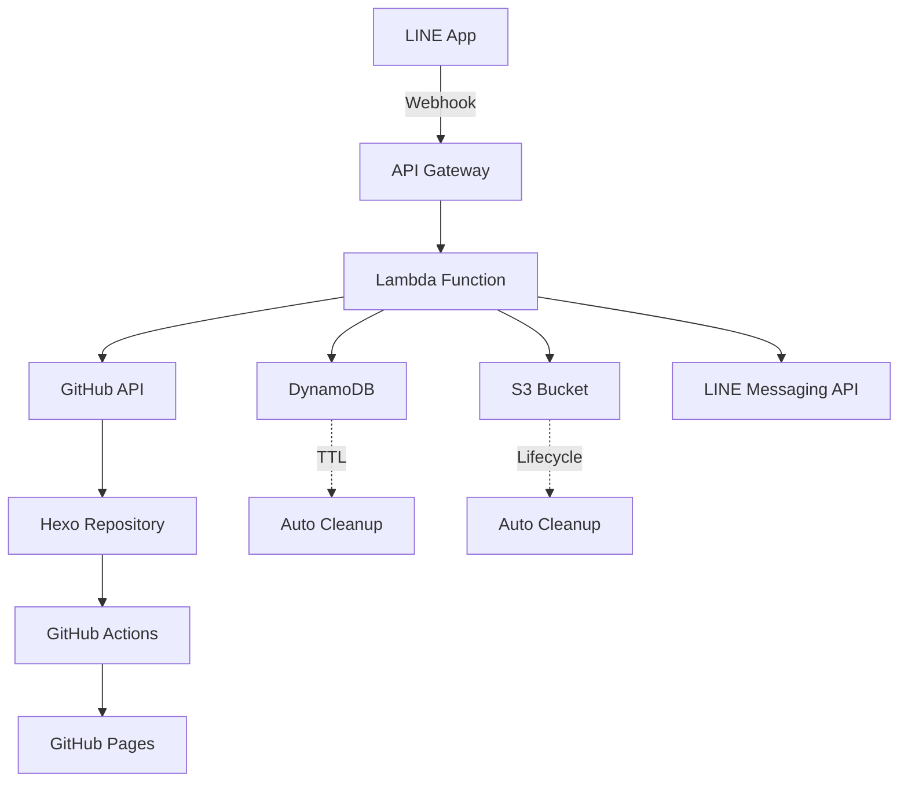
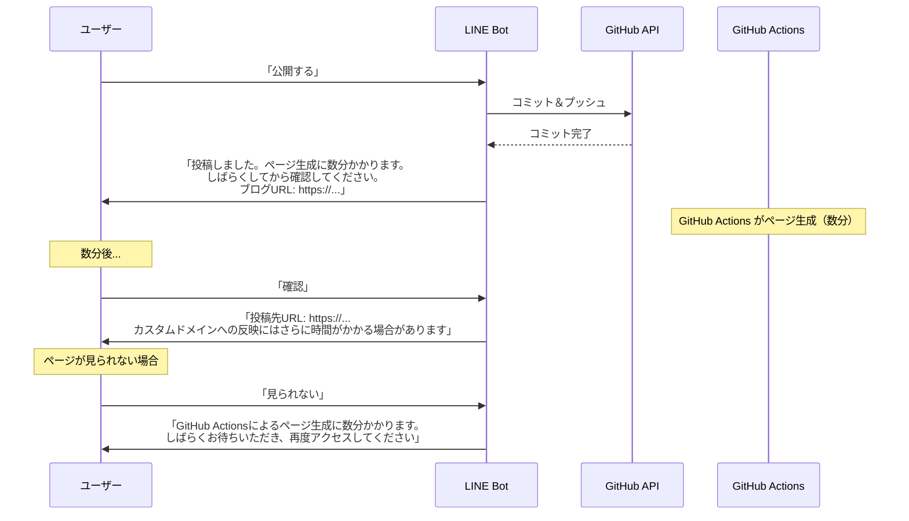

# Design Document: LINE Bot Blog Publisher

## Overview

LINE Bot経由でHexoブログを自動更新するサーバーレスシステム。ユーザーがLINEアプリから画像とテキストを送信し、対話型フローを通じてブログ投稿を作成する。システムはAWS Lambdaまたは類似のサーバーレス環境で動作し、GitHub APIを使用してHexoブログリポジトリを自動更新する。

## Architecture

### システム構成


```mermaid
graph TB
    A[LINE App] -->|Webhook| B[API Gateway]
    B --> C[Lambda Function]
    C --> D[DynamoDB]
    C --> E[S3 Bucket]
    C --> F[GitHub API]
    C --> G[LINE Messaging API]
    F --> H[Hexo Repository]
    H --> I[GitHub Actions]
    I --> J[GitHub Pages]

    D -.->|TTL| K[Auto Cleanup]
    E -.->|Lifecycle| L[Auto Cleanup]
```

### サーバーレスサービス選択

**セッション保持**:
- **DynamoDB**: セッション状態の永続化
- TTL機能で24時間後の自動削除
- 単一ユーザーのため最小限のRead/Write容量

**画像一時保管**:
- **S3 Bucket**: 画像の一時保存
- Lifecycle Policy で24時間後の自動削除
- Lambda関数からの直接アップロード/ダウンロード

**代替案（Vercel Functions使用時)**:
- **セッション保持**: Vercel KV (Redis)
- **画像一時保管**: Vercel Blob Storage

### 主要コンポーネント

1. **Webhook Handler**: LINE Messaging APIからのWebhookを受信
2. **Conversation Manager**: 対話フローの状態管理（投稿後確認フロー含む）
3. **Session Storage**: ユーザーセッション状態の永続化
4. **Image Processor**: 画像のダウンロードと処理
5. **Post Generator**: Hexo形式のMarkdown生成
6. **GitHub Manager**: リポジトリへのファイル操作
7. **Tag Manager**: 既存タグの取得と管理
8. **LINE UI Builder**: Quick Reply / Flex Message / Rich Menu の構築（オプション）

## Components and Interfaces

### 1. Webhook Handler

```typescript
interface WebhookHandler {
  handleRequest(event: APIGatewayEvent): Promise<APIGatewayResponse>
  validateSignature(body: string, signature: string): boolean
  parseLineEvent(body: string): LineEvent[]
}

interface LineEvent {
  type: 'message' | 'follow' | 'unfollow'
  replyToken: string
  source: {
    userId: string
    type: 'user'
  }
  message?: LineMessage
}

interface LineMessage {
  type: 'text' | 'image'
  text?: string
  id?: string
}
```

### 2. Conversation Manager

```typescript
interface ConversationManager {
  processMessage(userId: string, message: LineMessage, replyToken: string): Promise<void>
  getCurrentState(userId: string): Promise<ConversationState>
  updateState(userId: string, newState: ConversationState): Promise<void>
  handlePostPublishQuery(userId: string, text: string, replyToken: string): Promise<void>
}

interface ConversationState {
  step: ConversationStep
  data: PostData
  createdAt: Date
  updatedAt: Date
  lastPublishedUrl?: string  // 直近の投稿URL（投稿後確認フロー用）
  lastPublishedAt?: Date     // 直近の投稿日時
}

enum ConversationStep {
  IDLE = 'idle',
  WAITING_TITLE = 'waiting_title',
  WAITING_CONTENT = 'waiting_content',
  WAITING_IMAGE = 'waiting_image',
  WAITING_TAGS = 'waiting_tags',
  CONFIRMING = 'confirming'
}

interface PostData {
  title?: string
  content?: string
  imageUrl?: string
  imagePath?: string
  tags: string[]
}
```

投稿完了後、IDLE状態に戻る際に `lastPublishedUrl` と `lastPublishedAt` をセッションに保持する。
IDLE状態で「確認」等のキーワードを受信した場合、`lastPublishedUrl` が存在すれば投稿先URLを再案内する。
投稿直後（`lastPublishedAt` から数分以内）に「見られない」等の報告があった場合、GitHub Actionsのページ生成遅延を説明する。

### 3. Session Storage

```typescript
interface SessionStorage {
  get(userId: string): Promise<ConversationState | null>
  set(userId: string, state: ConversationState): Promise<void>
  resetToIdle(userId: string): Promise<void>  // 投稿完了/キャンセル時にIDLE状態にリセット
  delete(userId: string): Promise<void>       // 完全削除（通常はTTLで自動削除）
  cleanup(): Promise<void>
}

// DynamoDB実装
class DynamoDBSessionStorage implements SessionStorage {
  constructor(private tableName: string) {}

  async get(userId: string): Promise<ConversationState | null> {
    // DynamoDB GetItem操作
  }

  async set(userId: string, state: ConversationState): Promise<void> {
    // DynamoDB PutItem操作（TTL付き）
  }

  async resetToIdle(userId: string): Promise<void> {
    // セッションをIDLE状態にリセット、PostDataをクリア
    const idleState: ConversationState = {
      step: ConversationStep.IDLE,
      data: { tags: [] },
      createdAt: new Date(),
      updatedAt: new Date()
    }
    await this.set(userId, idleState)
  }
}
```

### 4. Image Processor

```typescript
interface ImageProcessor {
  downloadImage(messageId: string): Promise<Buffer>
  uploadToTempStorage(imageBuffer: Buffer, filename: string): Promise<string>
  downloadFromTempStorage(key: string): Promise<Buffer>
  processImage(imageBuffer: Buffer): Promise<ProcessedImage>
  generateImagePath(originalName?: string): string
  cleanupTempStorage(key: string): Promise<void>
}

interface ProcessedImage {
  buffer: Buffer
  filename: string
  relativePath: string
  tempStorageKey: string  // S3キーまたはVercel Blob URL
  mimeType: string
  size: number
}

// AWS実装
class S3ImageProcessor implements ImageProcessor {
  constructor(private s3Client: S3Client, private bucketName: string) {}

  async uploadToTempStorage(imageBuffer: Buffer, filename: string): Promise<string> {
    const key = `temp-images/${Date.now()}-${filename}`
    // S3 PutObject with 24h lifecycle policy
    return key
  }
}

// Vercel実装
class VercelBlobImageProcessor implements ImageProcessor {
  async uploadToTempStorage(imageBuffer: Buffer, filename: string): Promise<string> {
    // Vercel Blob Storage upload
    return blobUrl
  }
}
```

### 5. Post Generator

```typescript
interface PostGenerator {
  generatePost(postData: PostData): Promise<GeneratedPost>
  generateFrontMatter(postData: PostData): string
  generateFilename(title: string): string
}

interface GeneratedPost {
  filename: string
  content: string
  frontMatter: HexoFrontMatter
}

interface HexoFrontMatter {
  title: string
  date: string
  tags: string[]
  categories?: string[]
  excerpt?: string
}
```

### 6. GitHub Manager

```typescript
interface GitHubManager {
  createFile(path: string, content: string, message: string): Promise<void>
  uploadImage(path: string, imageBuffer: Buffer, message: string): Promise<void>
  getExistingTags(): Promise<string[]>
  commitMultipleFiles(files: GitHubFile[], message: string): Promise<void>
}

interface GitHubFile {
  path: string
  content: string | Buffer
  encoding?: 'utf-8' | 'base64'
}
```

### 7. Tag Manager

```typescript
interface TagManager {
  getExistingTags(): Promise<string[]>
  formatTagsForSelection(tags: string[]): string
  formatTagsAsQuickReply(tags: string[]): LineQuickReply      // Quick Reply用ボタン形式
  formatTagsAsFlexMessage(tags: string[]): FlexMessagePayload  // Flex Message用ボタン形式
  parseSelectedTags(input: string): string[]
  isTagButtonSelection(input: string): boolean  // ボタン選択かテキスト入力かの判定
  validateTags(tags: string[]): boolean
}
```

タグ選択フェーズでは、既存タグをQuick ReplyまたはFlex Messageのボタンとして表示しつつ、
ユーザーが「新規:タグ名」形式でテキスト入力した場合も同時に受け付ける。
番号選択と新規タグの混在入力もサポートする（例: `1,3,新規：タグ名`）。

### 8. LINE UI Builder（オプション - Requirement 10）

```typescript
interface LineUIBuilder {
  // Quick Reply構築
  createStartQuickReply(): LineQuickReply
  createTagSelectionQuickReply(tags: string[]): LineQuickReply
  createConfirmationQuickReply(): LineQuickReply

  // Flex Message構築
  createTagSelectionFlexMessage(tags: string[]): FlexMessagePayload
  createPostPreviewFlexMessage(postData: PostData): FlexMessagePayload

  // Rich Menu管理
  createRichMenuPayload(): RichMenuPayload
}

// LINE Quick Reply型
interface LineQuickReply {
  items: LineQuickReplyItem[]
}

interface LineQuickReplyItem {
  type: 'action'
  action: {
    type: 'message' | 'postback'
    label: string
    text?: string
    data?: string
  }
}

// Flex Message型
interface FlexMessagePayload {
  type: 'flex'
  altText: string
  contents: FlexContainer
}

interface FlexContainer {
  type: 'bubble' | 'carousel'
  body?: FlexComponent
  footer?: FlexComponent
}

interface FlexComponent {
  type: 'box' | 'button' | 'text'
  layout?: 'vertical' | 'horizontal'
  contents?: FlexComponent[]
  action?: { type: 'message'; label: string; text: string }
  text?: string
  size?: string
  color?: string
}

// Rich Menu型
interface RichMenuPayload {
  size: { width: number; height: number }
  selected: boolean
  name: string
  chatBarText: string
  areas: RichMenuArea[]
}

interface RichMenuArea {
  bounds: { x: number; y: number; width: number; height: number }
  action: { type: 'message'; text: string }
}
```

LINE UI Builderは Requirement 10（オプション）の実装に使用する。
既存の `LineApiClient` に既に `createTagSelectionQuickReply()` や `createConfirmationQuickReply()` が実装されているため、
LINE UI Builderはこれらを拡張・統合する形で実装する。

## Data Models

### セッション状態モデル

```typescript
// DynamoDB テーブル設計
interface SessionRecord {
  userId: string          // Partition Key
  state: ConversationState
  ttl: number            // TTL (24時間後に自動削除)
}

// セッションライフサイクル
// 1. 投稿作成開始時: 新規セッション作成
// 2. 投稿完了時: セッションをIDLE状態にリセット（削除しない）
//    - lastPublishedUrl と lastPublishedAt を保持
// 3. キャンセル時: セッションをIDLE状態にリセット
// 4. 24時間非アクティブ: TTLによる自動削除
// 5. 連続投稿: 既存セッションを再利用してIDLE→WAITING_TITLEに遷移
// 6. 投稿後確認: IDLE状態で「確認」受信時、lastPublishedUrlからURL再案内
```

### 画像一時保管モデル

```typescript
// S3 Bucket設計
interface TempImageStorage {
  bucket: string          // "linebot-temp-images"
  key: string            // "temp-images/{timestamp}-{filename}"
  lifecyclePolicy: {
    expiration: "24 hours"  // 自動削除
  }
}

// Vercel Blob代替案
interface VercelBlobStorage {
  url: string            // Vercel Blob URL
  ttl: number           // 24時間TTL
}
```

### Hexo投稿モデル

```yaml
# Hexo Front-matter形式
---
title: "投稿タイトル"
date: 2024-01-15 10:30:00
tags:
  - タグ1
  - タグ2
categories:
  - カテゴリ
excerpt: "投稿の概要"
---

投稿本文がここに入ります。


追加のコンテンツ...
```

### 対話フロー

```mermaid
stateDiagram-v2
    [*] --> IDLE
    IDLE --> WAITING_TITLE : "投稿作成"
    WAITING_TITLE --> WAITING_CONTENT : タイトル入力
    WAITING_CONTENT --> WAITING_IMAGE : 本文入力
    WAITING_IMAGE --> WAITING_TAGS : 画像送信
    WAITING_TAGS --> CONFIRMING : タグ選択
    CONFIRMING --> IDLE : 公開完了/キャンセル

    WAITING_TITLE --> IDLE : "キャンセル"
    WAITING_CONTENT --> IDLE : "キャンセル"
    WAITING_IMAGE --> IDLE : "キャンセル"
    WAITING_TAGS --> IDLE : "キャンセル"

    note right of IDLE : セッションは削除されず\nIDLE状態で保持\n連続投稿可能
    note left of CONFIRMING : 公開完了時:\n1. GitHub コミット完了を待つ\n2. 成功メッセージ送信\n3. lastPublishedUrl を保持
```

### 投稿後確認フロー


```mermaid
sequenceDiagram
    participant U as ユーザー
    participant B as LINE Bot
    participant G as GitHub API
    participant GA as GitHub Actions

    U->>B: 「公開する」
    B->>G: コミット＆プッシュ
    G-->>B: コミット完了
    B->>U: 「投稿しました。ページ生成に数分かかります。<br/>しばらくしてから確認してください。<br/>ブログURL: https://...」
    Note over GA: GitHub Actions がページ生成（数分）
    Note over U: 数分後...
    U->>B: 「確認」
    B->>U: 「投稿先URL: https://...<br/>カスタムドメインへの反映にはさらに時間がかかる場合があります」
    Note over U: ページが見られない場合
    U->>B: 「見られない」
    B->>U: 「GitHub Actionsによるページ生成に数分かかります。<br/>しばらくお待ちいただき、再度アクセスしてください」
```

### 投稿完了メッセージの制約

投稿の成功メッセージは、GitHub APIへのコミット・プッシュ操作が実際に完了（APIレスポンス受信）した後にのみ送信する。
非同期処理やfire-and-forgetパターンは使用せず、`await` でコミット完了を確認してからメッセージを送信する。

```typescript
// 正しい実装パターン
async function publishPost(postData: PostData, replyToken: string): Promise<void> {
  // 1. GitHub にコミット＆プッシュ（完了を待つ）
  await githubManager.commitMultipleFiles(files, commitMessage)

  // 2. コミット完了後にのみ成功メッセージを送信
  await lineClient.sendTextMessage(replyToken,
    `投稿をしました！🎉\n\n` +
    `ページの生成に数分かかるため、しばらくしてから確認してください。\n` +
    `カスタムドメインへの反映にはさらに時間がかかる場合があります。\n\n` +
    `ブログURL: ${blogUrl}`
  )
}
```

## Correctness Properties

*A property is a characteristic or behavior that should hold true across all valid executions of a system-essentially, a formal statement about what the system should do. Properties serve as the bridge between human-readable specifications and machine-verifiable correctness guarantees.*

### Property Reflection

プロパティの冗長性を分析した結果、以下の統合を行います：

- **状態管理プロパティ**: 1.2と2.2は状態遷移の同じ側面をテストするため、統合
- **画像処理プロパティ**: 3.1-3.4は画像処理パイプラインの連続した処理として統合
- **投稿生成プロパティ**: 4.1-4.6は投稿生成の包括的なプロセスとして統合
- **GitHub操作プロパティ**: 5.1-5.3はファイル操作の一連の流れとして統合
- **エラーハンドリング**: 6.2, 6.3, 6.5は異なるレベルのエラー処理として個別に保持
- **成功メッセージ**: 6.1, 9.1, 9.2は全て投稿完了メッセージの内容要件のため、1つのプロパティに統合
- **投稿後確認フロー**: 9.3, 9.4は投稿後のIDLE状態での確認フローのため、1つのプロパティに統合
- **タグUI**: 10.2（UI構築）と10.3（入力パース）は異なる側面のため個別に保持

### Correctness Properties

### Property 1: 対話フロー状態遷移

*For any* 有効なユーザー入力と現在の会話状態に対して、システムは適切な次の状態に遷移し、対応するガイダンスメッセージを返信する

**Validates: Requirements 1.2, 2.2**

### Property 2: 画像処理パイプライン

*For any* 有効な画像ファイルに対して、システムはダウンロード、形式検証、リサイズ（必要時）、一意ファイル名生成、適切なパス生成を順次実行する

**Validates: Requirements 1.3, 3.1, 3.2, 3.3, 3.4**

### Property 3: セッション永続化

*For any* ユーザーセッションに対して、状態の更新、保存、復元が一貫して動作し、システム再起動後も状態が保持される

**Validates: Requirements 2.1, 2.5**

### Property 4: 投稿生成統合性

*For any* 完全な投稿データ（タイトル、本文、画像、タグ）に対して、システムはテンプレートに基づいたHexo形式のMarkdownファイルを生成し、適切なfront-matterとファイル名で保存する

**Validates: Requirements 4.1, 4.2, 4.3, 4.4, 4.5, 4.6**

### Property 5: GitHub操作原子性

*For any* 投稿ファイルと画像ファイルの組み合わせに対して、システムは両方のファイルを適切なディレクトリにコミットし、意味のあるコミットメッセージを生成する

**Validates: Requirements 5.1, 5.2, 5.3**

### Property 6: エラーハンドリング多層防御

*For any* システムエラーに対して、適切なレベル（ユーザー通知、ログ記録、管理者通知）でエラーハンドリングが実行される

**Validates: Requirements 6.2, 6.3**

### Property 7: セキュリティ検証

*For any* 受信リクエストに対して、署名検証、認証確認、アクセス制御が適切に実行される

**Validates: Requirements 7.2, 7.3, 7.5**

### Property 8: サーバーレス制約遵守

*For any* リクエスト処理に対して、ステートレス処理、リソースクリーンアップ、並行処理安全性が保証される

**Validates: Requirements 8.2, 8.3, 8.4**

### Property 9: 無効入力拒否

*For any* 無効な入力（形式エラー、権限なし、不正データ）に対して、システムは適切なエラーメッセージで拒否し、システム状態を保護する

**Validates: Requirements 1.6, 3.5, 5.5, 6.5**

### Property 10: 成功時通知完全性

*For any* 成功した投稿処理に対して、システムはユーザーに送信する成功メッセージが以下の全てを含む：ブログURL、ページ生成に数分かかる旨の説明、カスタムドメインへの反映遅延の説明

**Validates: Requirements 6.1, 9.1, 9.2**

### Property 11: 成功メッセージ送信順序

*For any* 投稿公開処理に対して、成功メッセージはGitHubへのコミット・プッシュAPIが正常レスポンスを返した後にのみ送信される

**Validates: Requirements 6.6**

### Property 12: 投稿後確認フロー応答

*For any* 投稿完了後のIDLE状態で、確認系キーワード（「確認」「見られない」等）を受信した場合、応答には投稿先ブログURLとページ生成遅延の説明が含まれる

**Validates: Requirements 9.3, 9.4**

### Property 13: タグ選択UIのタグ網羅性（オプション）

*For any* 既存タグリストに対して、生成されるQuick ReplyまたはFlex Messageは全ての既存タグをボタンとして含む（LINE Quick Replyの上限13件以内）

**Validates: Requirements 10.2**

### Property 14: タグ入力の二重受付（オプション）

*For any* タグ選択フェーズでの入力に対して、既存タグ名のボタン選択と「新規:タグ名」形式のテキスト入力の両方を正しくパースしてタグリストに変換する

**Validates: Requirements 10.3**

## Error Handling

### エラー分類と対応

1. **ユーザーエラー**
   - 無効な入力形式
   - 不正な画像ファイル
   - 対応: 日本語での分かりやすいガイダンス

2. **システムエラー**
   - GitHub API障害
   - LINE API障害
   - 対応: ログ記録、管理者通知、ユーザーへの一般的なエラー通知

3. **リソースエラー**
   - メモリ不足
   - タイムアウト
   - 対応: 適切なクリーンアップとエラー通知

### エラー回復戦略

- **画像処理失敗**: デフォルト画像使用
- **GitHub操作失敗**: リトライ機構（指数バックオフ）
- **セッション喪失**: 新規セッション作成案内

## Testing Strategy

### 二重テストアプローチ

**Unit Tests**:
- 特定の例とエッジケースの検証
- 各コンポーネントの統合ポイント
- エラー条件とフォールバック動作

**Property-Based Tests**:
- 全入力に対する普遍的プロパティの検証
- ランダム化による包括的入力カバレッジ
- 最小100回の反復実行

### Property-Based Testing設定

- **ライブラリ**: fast-check (Node.js/TypeScript)
- **実行回数**: 各プロパティテストで最小100回
- **タグ形式**: **Feature: linebot-blog-publisher, Property {number}: {property_text}**

### テストカバレッジ

**Unit Tests重点領域**:
- LINE Webhook署名検証
- 画像形式バリデーション
- Hexo front-matter生成
- GitHub API認証
- 投稿完了メッセージの内容検証（ページ生成遅延説明、カスタムドメイン遅延説明、URL含有）
- 投稿後確認フロー（「確認」「見られない」キーワード応答）
- Quick Reply / Flex Message構築（Requirement 10 - オプション）
- Rich Menu「投稿作成」ボタン存在確認（Requirement 10 - example）
- 確認フェーズ「公開する」「キャンセル」Quick Reply存在確認（Requirement 10 - example）

**Property Tests重点領域**:
- 状態遷移の一貫性（Property 1）
- データ変換の正確性（Property 2, 4）
- セッション永続化の一貫性（Property 3）
- GitHub操作の原子性（Property 5）
- エラーハンドリングの完全性（Property 6）
- セキュリティ制約の遵守（Property 7）
- サーバーレス制約の遵守（Property 8）
- 無効入力の拒否（Property 9）
- 成功メッセージの完全性（Property 10）
- 成功メッセージ送信順序の保証（Property 11）
- 投稿後確認フローの応答正確性（Property 12）
- タグ選択UIのタグ網羅性（Property 13 - オプション）
- タグ入力の二重受付パース（Property 14 - オプション）